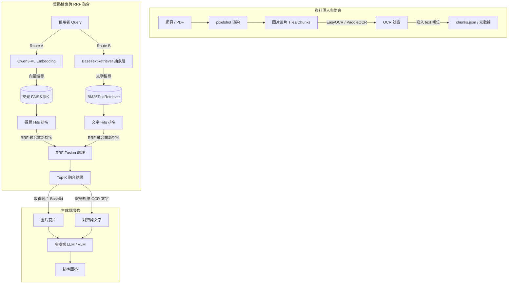

# PixelRAG 混合檢索與雙階段純文字增強設計規格書 (Hybrid RAG Design Spec)

本文件定義了為 PixelRAG 系統引入「純文字輔助」的架構設計。透過結合視覺檢索 (Dense Visual) 與純文字檢索 (Sparse/Dense Text)，並在生成端同時輸入圖片與對齊的文字，以大幅提升系統在關鍵字匹配、細小文字辨識以及整體回答的精準度。

---

## 1. 系統架構與資料流 (System Architecture)

混合 RAG 系統分為三個核心階段：
1. **資料匯入與對齊 (Ingestion & Alignment)**：在將網頁/PDF 渲染並切分成圖片塊時，同步生成對齊的純文字。
2. **雙路檢索與融合 (Retrieval & Fusion)**：檢索時同時搜尋「視覺向量索引」與「文字索引」，並使用 RRF 演算法將結果融合排序。
3. **生成端增強 (Generation / Reader Stage)**：將檢索出的 Top-K 圖片及其對應的對齊純文字，一併輸入給多模態 LLM (VLM) 進行回答。



---

## 2. 詳細設計 (Detailed Design)

### 2.1 資料匯入與 OCR 對齊
為了解決網頁與 PDF 混合來源下，座標計算與對齊邏輯極度複雜的問題，本設計採用**「基於圖片 Chunk 的 OCR 辨識」**來完成對齊：
* 在 `pixelrag_embed/chunk.py` 處理切分瓦片時，對每一個產生的 `chunk_XXXX_YY.png` 執行輕量級 OCR（預設使用 `EasyOCR` 或 `PaddleOCR`）。
* 將 OCR 提取出的純文字內容寫入該文章目錄下的 `chunks.json` 中。
* **`chunks.json` 格式變更**：
  ```json
  {
    "tile_hashes": { ... },
    "chunks": [
      {
        "tile": 0,
        "chunk_index": 0,
        "file": "chunk_0000_00.png",
        "y_offset": 0,
        "height": 1024,
        "text": "這是從該圖片區塊辨識出的純文字內容..."
      }
    ]
  }
  ```

### 2.2 文字檢索抽象層 (Abstraction Layer)
為了保全系統的輕量性，同時為日後擴充至企業級搜尋引擎（如 Elasticsearch）保留彈性，我們在 `pixelrag_serve` 中設計 `BaseTextRetriever` 抽象介面。

新增檔案：[text_retriever.py](file:///Users/tenyi/Projects/PixelRAG/serve/src/pixelrag_serve/text_retriever.py)

```python
from abc import ABC, abstractmethod
from typing import List, Dict, Any

class BaseTextRetriever(ABC):
    @abstractmethod
    def index(self, articles_metadata: List[Dict[str, Any]]) -> None:
        """建立或載入純文字索引
        articles_metadata 應包含每個 chunk 的標識與對齊文字，例如：
        [
            {
                "article_id": 123,
                "tile_index": 0,
                "chunk_index": 0,
                "text": "..."
            },
            ...
        ]
        """
        pass

    @abstractmethod
    def search(self, query_text: str, top_k: int) -> List[Dict[str, Any]]:
        """搜尋最相關的 chunks
        回傳結構應包含：
        [
            {
                "article_id": 123,
                "tile_index": 0,
                "chunk_index": 0,
                "score": float  # 原始檢索得分
            },
            ...
        ]
        """
        pass
```

#### 預設輕量實作：`BM25TextRetriever`
* 使用 `rank-bm25` 套件（純 Python 實現的 BM25 演算法）。
* 服務啟動時，從 `tiles` 目錄遍歷並載入所有 `chunks.json`，在記憶體中建立 BM25 索引。由於其記憶體佔用極低（僅保存分詞後的 token 陣列），非常適合百萬級別以下的 chunk 規模。

#### 未來擴充實作（如 `ElasticsearchTextRetriever`）
* 日後只需繼承 `BaseTextRetriever`，在 `index` 時將資料寫入 ES，在 `search` 時透過 REST API 對 ES 發送查詢，即可無縫替換，而無須修改外層的檢索融合與 API 邏輯。

### 2.3 雙路檢索與 RRF 融合排序 (Reciprocal Rank Fusion)
當 `serve/api.py` 收到 `/search` 請求時：
1. **視覺路**：透過現有的多模態嵌入與 FAISS 搜尋，取得前 $N$ 個最相關的候選圖片瓦片（排好序的 list）。
2. **文字路**：調用 `BaseTextRetriever.search`，取得前 $N$ 個最相關的候選文字段落（排好序的 list）。
3. **排名融合**：使用 RRF 演算法合併雙路排名。對於候選瓦片 $d$（以 `(article_id, tile_index, chunk_index)` 作為唯一鍵）：
   $$RRF\_Score(d) = \sum_{m \in \{visual, text\}} \frac{1}{k + Rank_m(d)}$$
   * 其中 $Rank_m(d)$ 是瓦片 $d$ 在檢索路 $m$ 中的名次（若未在該路出現則名次視為無窮大，權重為 0）。
   * $k$ 是平滑常數（通常設為 60）。
4. 最終依據 $RRF\_Score$ 由高到低排序，取出前 `n_docs` 個瓦片回傳。

### 2.4 生成端圖文並行輸入
* **API 回傳擴充**：`/search` 端點的 `Hit` 模型新增一個可選的 `text` 欄位，回傳該圖片 chunk 所對應 of OCR 純文字。
* **VLM Prompt 增強**：在 Chat Agent (例如 `agent-server.mjs` 或 Web 前端) 組合 prompt 時，改變僅傳送圖片的作法，改為：
  ```markdown
  系統上下文資訊如下：
  
  [區塊 1]
  文字內容：<對齊的純文字 1>
  視覺圖片：[圖片瓦片 1]
  
  [區塊 2]
  文字內容：<對齊的純文字 2>
  視覺圖片：[圖片瓦片 2]
  
  請結合上方提供的圖片視覺資訊以及其所對應的精確純文字回答使用者的問題。
  ```

---

## 3. 開發與相依性變更 (Dependencies)

需要引入以下 Python 依賴（在 `pyproject.toml` 的對應 extra 或 `project.dependencies` 中使用 `uv add` 加入）：
* `easyocr` (或 `paddleocr`，推薦 easyocr 因為其跨平台安裝較簡單)
* `rank-bm25`

---

## 4. 驗證計劃 (Verification Plan)

### 4.1 單元測試 (Unit Tests)
* 撰寫 `test_text_retriever.py` 驗證 `BaseTextRetriever` 抽象介面的正確性，並測試 `BM25TextRetriever` 能正確索引文字並搜尋出對應的 `article_id` 與 chunk 座標。
* 撰寫 `test_rrf_fusion.py` 驗證 RRF 融合邏輯，確認當視覺路與文字路名次不同時，融合得分計算正確。

### 4.2 基準評估 (Evaluation Benchmark)
* 使用 `eval/run_bench.py`。
* 比較單純視覺檢索 (Pixel-only RAG) 與混合檢索 (Hybrid Text-Pixel RAG) 在 QA 數據集上的表現，重點關注包含「細小實體、數字、特定代碼」的檢索召回率 (Retrieval Recall) 與答對率 (Accuracy) 是否顯著提升。
