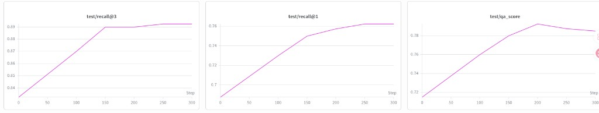
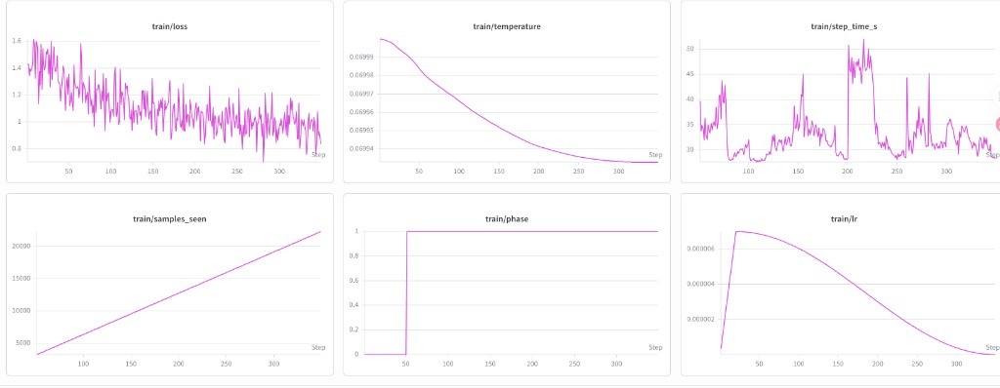
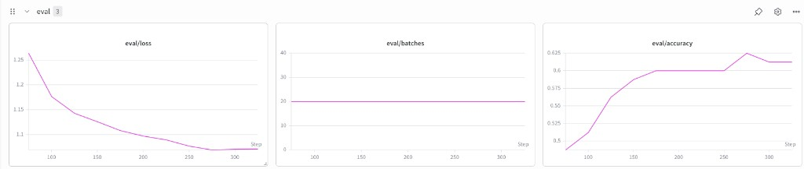

# Reproducing the Training Run (SOTA embedding fine-tune, QA ≈ 0.785)

This document is a **complete, self-contained recipe** for reproducing the
embedding fine-tuning training run from scratch on a fresh machine: environment,
dataset downloads, model serving, the exact training command, and what to expect.

This is a LoRA fine-tune of `Qwen/Qwen3-VL-Embedding-2B` for visual document
retrieval, with **ViT LoRA + text warmup + hard negatives**. On the `miniv8` test
set (400 SimpleQA questions, 7426 candidate tiles) it reaches a peak **QA score
≈ 0.785** (vs. ~0.715–0.730 for the untrained base model).

Original W&B run: <https://wandb.ai/yichuan_wang-uc-berkeley-electrical-engineering-computer/wiki-screenshot-training/runs/2y39owix>

---

## ⚠️ Before you start: two API keys

You need **two API keys** to fully reproduce this run. Get them ready first:

1. **OpenAI API key** (`OPENAI_API_KEY`) — **required for evaluation.** During each
   eval step, the model retrieves images and a vLLM "reader" answers each test
   question; those answers are then **graded against the test set's gold answers
   by an OpenAI model** (`gpt-4.1-2025-04-14`). This grade *is* the headline **QA
   score**. Without a working key the QA score is silently **0** (the grader
   swallows errors), so the run looks broken even though training is fine.
   > Some keys are region-locked — if you get a 401 saying "make your request to
   > us.api.openai.com", set `OPENAI_BASE_URL=https://us.api.openai.com/v1`.

2. **W&B API key** (`WANDB_API_KEY`) — **required to log the curve online** and
   reproduce the dashboard above. Get it at <https://wandb.ai/authorize>. If you
   don't care about online logging, run with `WANDB_MODE=offline` instead (metrics
   still land in local `eval_step*.jsonl`).

Both are only consumed once training reaches the first eval step (and W&B at
launch), but set them **before** you start so a multi-hour run isn't wasted.

---

## 0. What you need (and when)

| Resource | Needed for | When |
|---|---|---|
| 1× GPU (≥40 GB, e.g. H100/A100) for **training** | the fine-tune | whole run |
| 1× GPU for **vLLM** (the QA "reader", `Qwen3-VL-4B-Instruct`) | QA eval at each `--test-eval-steps` | from first eval step |
| **OpenAI API key** (`gpt-4.1` grader) | grading reader answers in QA eval | from first eval step |
| **W&B API key** *(optional)* | online loss/metric curves | start of run (else use offline) |
| ~**95 GB free disk** for images, ideally **fast/local** storage | dataset images | whole run |
| ~200 GB scratch during download+extract | tar shards + extracted images | setup only |

> ⚠️ **The OpenAI key and the vLLM endpoint are only used during *evaluation*.**
> If neither is available, training still runs — but the QA score will be 0/blank.
> The grader silently returns 0 on any error (including a bad key / wrong base URL),
> so **verify the key works before launching** (see §6).

> ⚠️ **HF token (optional but recommended):** unauthenticated HF downloads are
> rate-limited and slow. `export HF_TOKEN=hf_...` before downloading the ~93 GB
> image dataset for higher throughput.

---

## 1. Environment

Pinned versions are **mandatory** — mismatches cause silent numerical drift:

| Package | Version |
|---|---|
| PyTorch | 2.9.1+cu129 |
| cuDNN | 9.20.0.48 |
| transformers | 4.57.1 |

These are locked in `train/pyproject.toml` + `uv.lock`. Install with [uv](https://docs.astral.sh/uv/):

```bash
cd train
uv sync          # creates .venv with the exact locked versions
```

Always run training/eval via `uv run` so the locked env is used.

---

## 2. Download the datasets

Three datasets are required. Pick a data root on a large disk:

```bash
export DATA_ROOT=/big/disk/visrag/data
mkdir -p "$DATA_ROOT"
```

### 2a. Training data — `screenshot-training-natural-filtered-v2` (~93.5 GB)

104K train / 5.8K eval / 5.8K test query–image pairs with 2 hard negatives each,
plus 1000 tar-sharded image archives.

```bash
hf download Chrisyichuan/screenshot-training-natural-filtered-v2 \
    --repo-type dataset \
    --local-dir "$DATA_ROOT/screenshot-training-natural-filtered-v2"
```

This gives `train_hn.jsonl`, `eval_hn.jsonl`, `test_hn.jsonl` at the root and
`image_shards/shard_000.tar … shard_999.tar`.

### 2b. Test set — `test_miniv8` (~2 GB, lives in the `screenshot-training` repo)

400 SimpleQA questions + 7426 candidate tiles, used for retrieval (R@1/R@3) and
QA-score eval.

```bash
hf download Chrisyichuan/screenshot-training \
    --repo-type dataset --include "test_miniv8/*" \
    --local-dir "$DATA_ROOT/screenshot-training"
```

### 2c. Text-warmup data — `text-qa-pair` (~1.8 GB, text only)

Text query→passage pairs with hard negatives, used for the 50-step text warmup.
Already in the `chunk_*/filtered_hn.jsonl` layout the trainer expects.

```bash
hf download Chrisyichuan/text-qa-pair \
    --repo-type dataset \
    --local-dir "$DATA_ROOT/text-qa-pair"
```

---

## 3. Extract images

The JSONL rows reference images by relative path `images/shard_XXX/...`, resolved
**relative to the JSONL file's directory**. So images must end up at
`<dataset-dir>/images/`.

```bash
# Training images (1000 shards → images/). SLOW on networked filesystems —
# extract to fast/local storage. ~200K small PNGs.
python "$DATA_ROOT/screenshot-training-natural-filtered-v2/extract_hf_image_shards.py" \
    --dataset-dir "$DATA_ROOT/screenshot-training-natural-filtered-v2"

# Test tiles
cd "$DATA_ROOT/screenshot-training/test_miniv8"
mkdir -p tiles && tar xf tiles.tar -C tiles
```

> **Performance note:** extracting/reading hundreds of thousands of tiny PNGs over
> NFS is extremely slow. Extract `images/` onto local SSD or RAM-disk (`/dev/shm`)
> if available, and `ln -s` it back into the dataset dir so the relative paths
> resolve.

---

## 4. Serve the vLLM reader

The QA eval retrieves images, then asks `Qwen3-VL-4B-Instruct` to answer each
question from the retrieved image (the "reader"). Serve it on a **separate GPU**
from training. Use the pinned serving env in `serve/` / `serving/vllm/`:

```bash
cd serving/vllm        # (or serve/) — has its own uv.lock for vLLM
uv sync
CUDA_VISIBLE_DEVICES=<VLLM_GPU> uv run vllm serve Qwen/Qwen3-VL-4B-Instruct \
    --dtype auto --port 8200 --max-model-len 65536 \
    --gpu-memory-utilization 0.8 --api-key dummy
# verify:  curl -s http://localhost:8200/v1/models
```

---

## 5. API keys

```bash
# Grader (QA scoring). The grader uses gpt-4.1-2025-04-14.
export OPENAI_API_KEY=sk-...
# Use the host your key requires. Some keys are region-locked and 401 on the
# default host with "make your request to us.api.openai.com" — then use:
export OPENAI_BASE_URL=https://us.api.openai.com/v1   # or https://api.openai.com/v1, or your gateway

# Optional: online W&B curves matching the original run
export WANDB_API_KEY=...        # else: export WANDB_MODE=offline
```

Sanity-check the grader before a long run:

```bash
uv run python - <<'PY'
import os, openai
c = openai.OpenAI(api_key=os.environ["OPENAI_API_KEY"], base_url=os.environ.get("OPENAI_BASE_URL"))
print(c.chat.completions.create(model="gpt-4.1-2025-04-14",
      messages=[{"role":"user","content":"reply CORRECT"}]).choices[0].message.content)
PY
```

---

## 6. Run training

The exact training command (adjust the paths to your `$DATA_ROOT`):

```bash
cd train
CUDA_VISIBLE_DEVICES=<TRAIN_GPU> uv run python train_contrastors.py \
    --data-split-dir "$DATA_ROOT/screenshot-training-natural-filtered-v2" \
    --text-warmup-steps 50 \
    --text-data-dir "$DATA_ROOT/text-qa-pair" \
    --test-data "$DATA_ROOT/screenshot-training/test_miniv8/test_miniv8.json" \
    --max-steps 350 \
    --batch-size 64 \
    --grad-cache-chunk 4 \
    --num-hard-negatives 2 \
    --lr 7e-6 \
    --warmup-steps 20 \
    --scheduler cosine \
    --test-batch-size 16 \
    --eval-steps 25 \
    --test-eval-steps 50 \
    --save-steps 50 \
    --max-num-visual-tokens 4096 \
    --lora-vit \
    --simpleqa-max-examples 1000 \
    --vllm-url http://localhost:8200/v1 \
    --vllm-model Qwen/Qwen3-VL-4B-Instruct \
    --wandb-run-name v8r \
    --output-dir "$OUTPUT_DIR/v8_r_warmup50_lr7e6_lora_vit_350"
```

What the flags mean (key ones):

- `--lora-vit` — apply LoRA to the ViT vision encoder too (the single biggest win).
- `--text-warmup-steps 50` + `--text-data-dir` — 50 steps of text-only contrastive
  warmup before image training (hard switch).
- `--num-hard-negatives 2` — the dataset has exactly 2 mined hard negatives per row.
- `--batch-size 64 --grad-cache-chunk 4` — GradCache keeps memory ∝ chunk, not batch.
- `--test-eval-steps 50` — full retrieval + QA eval every 50 steps (needs vLLM + grader).

**Sanity checks in the startup logs** (confirm your setup is correct before waiting hours):

- `trainable params: 25,427,968 || all params: 2,152,960,000 || trainable%: 1.1811`
  — this exact count means `--lora-vit` is applied (LLM + ViT + merger). Without
  `--lora-vit` it's ~12.8M.
- `Loaded 104033 valid pairs … train_hn.jsonl` / `Loaded 5779 … eval_hn.jsonl`
  (test split = 5781) — confirms the training data resolved.
- `Loaded 14952 text pairs …` — confirms the text-warmup data resolved.
- `Loaded test 'miniv8': 400 questions, 7426 tiles` — confirms the test set + tiles resolved.

> **`tiles_dir` gotcha:** the trainer reads `test_miniv8.json`'s `tiles_dir` field
> **as-is, relative to the current working directory** (not relative to the JSON
> file). The shipped value is `"test_miniv8/tiles"`. Either run training from the
> directory that contains `test_miniv8/tiles`, or edit the JSON to an **absolute**
> tiles path. A wrong `tiles_dir` yields `0 tiles` and a meaningless eval.

<details>
<summary>Eval cache and timing details</summary>

**Step-0 eval is slow, then partially cached:** the first eval embeds all 7426
doc tiles. The dominant cost is **CPU-side preprocessing** — PIL `Image.open` +
the Qwen3VL processor's resize / normalize / tokenize — which is single-threaded
per batch and starves the GPU (you'll see GPU util mostly 0% with brief spikes).
Cold cost: ~10–15 min on a dedicated GPU; longer on a shared one.

What's actually cached: the **preprocessed batch tensors** (`pixel_values`,
`image_grid_thw`, `input_ids`, `attention_mask`), saved to
`.tile_cache_n{N}_px{max_pixels}_bs{batch_size}.pt` next to the tiles. **This
file is huge** — `pixel_values` are the dominant payload. At
`max-num-visual-tokens=1024` (max_pixels ≈ 1 MB) the miniv8 cache is **~157 GB**;
at `4096` visual tokens (max_pixels ≈ 4 MB) it scales roughly linearly to
**~600 GB**. The `torch.save` itself takes ~15–20 min at ~150 MB/s sustained
write. Make sure the tiles directory lives on a volume with several hundred
GB free, not on a small `$HOME` partition.
Embeddings are **not** cached — the LoRA weights change each eval, so every
eval still does a fresh GPU forward over all 7426 tiles. Cache key includes
`batch_size` and `max_pixels`, so changing either invalidates it.

**Measured eval breakdown on a dedicated H100, `max-num-visual-tokens=1024`,
bs=16** (so cache is "only" 157 GB; 4096 visual tokens scales ~4× across the
board):

| Phase | Cold (step 0) | Warm (cache hit) |
|---|---|---|
| query embed (400) | 22 s | 1 s |
| doc embed (7426 tiles) | **46 min** (preprocess + fwd + `torch.save` 157 GB) | **27 min** (`torch.load` 157 GB ≈ 18 min + GPU fwd ≈ 9 min) |
| grader (400 SimpleQA) | 2 min | 2 min |
| **total** | **49 min** | **29 min** |

Big takeaway: even with the cache hit, each eval is ~half an hour because
`torch.load`ing a 157 GB pickle is itself ~18 minutes (NVMe-bound, ~145 MB/s
sustained — much slower than raw NVMe because of pickle deserialization). At
`4096` visual tokens, expect roughly 4× — `torch.load` alone takes ~70 min per
eval. Budget accordingly when picking `--test-eval-steps`.

</details>

---

## 7. What to expect

- ~350 steps, single GPU, ≈ a few seconds/step plus eval overhead.
- QA score (primary metric) climbs in a staircase and **peaks around step 150–250
  at ≈ 0.785**, then may decay slightly (overfitting) — checkpoint at the peak.
- Per-eval results are written to `eval_step<N>.jsonl` in the output dir; QA score
  = fraction of rows with `correct: true`. Quick peak extraction:

```python
import json, glob
peak = 0
for f in sorted(glob.glob("OUTPUT_DIR/eval_step*.jsonl")):
    rows = [json.loads(l) for l in open(f)]
    qa = sum(r.get("correct", False) for r in rows) / len(rows)
    step = int(f.split("eval_step")[1].split(".")[0])
    peak = max(peak, qa); print(step, round(qa, 4))
print("peak", round(peak, 4))
```

- Retrieval R@1/R@3 are logged too; note R@1 is **not** monotone with QA — query
  embeddings can get more useful for QA even as exact-tile match rate dips.

---

## 8. Results for reference

The screenshots below are the **ideal loss / metric curves** from the run used
while writing the paper. Use these as the visual reference for a healthy run:
train loss should trend downward, eval loss should steadily improve, and
`test/qa_score`, `test/recall@1`, and `test/recall@3` should climb in the same
stair-step pattern.







For the open-source release run, the 2× H100 loss curve is available in W&B:
<https://wandb.ai/yichuan_wang-uc-berkeley-electrical-engineering-computer/wiki-screenshot-training/runs/qx7mt16x?nw=nwuseryichuan_wang>.
If you cannot access the run, email `yichuan_wang@berkeley.edu`.

---

## 9. Troubleshooting

- **QA score is 0 / blank** → grader not reachable. Check `OPENAI_API_KEY`,
  `OPENAI_BASE_URL`, and that vLLM answers `curl .../v1/models`. The grader
  swallows errors and returns 0, so a silent 0 almost always means a key/endpoint problem.
- **`Image.open` errors / missing files** → images not fully extracted, or
  `images/` is not next to the JSONL. Verify a path:
  `ls "$DATA_ROOT/.../images/shard_812/..."`.
- **Slow startup / step-0 eval hangs** → CPU-bound tile preprocessing on first
  eval; with many parallel runs it can thrash. Run one at a time, or warm the
  tile cache first.
- **vLLM eval queue stalls** → one vLLM instance shared across many runs bottlenecks
  evals. Use a dedicated instance per run or stagger eval schedules.
